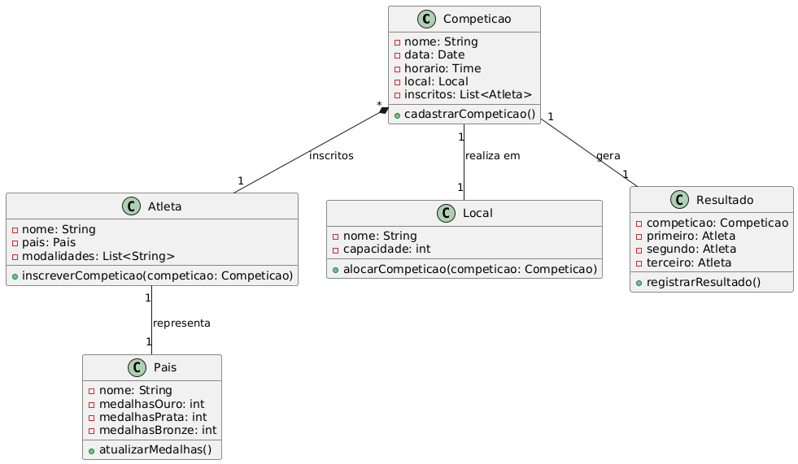
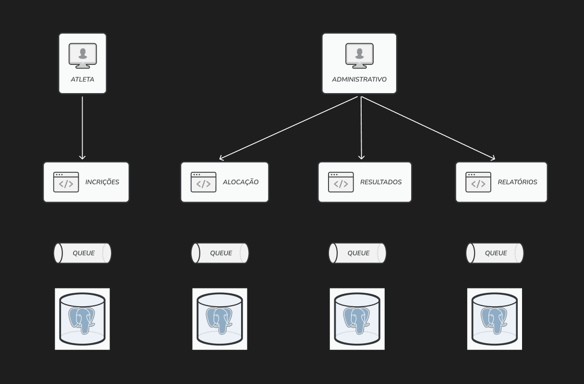
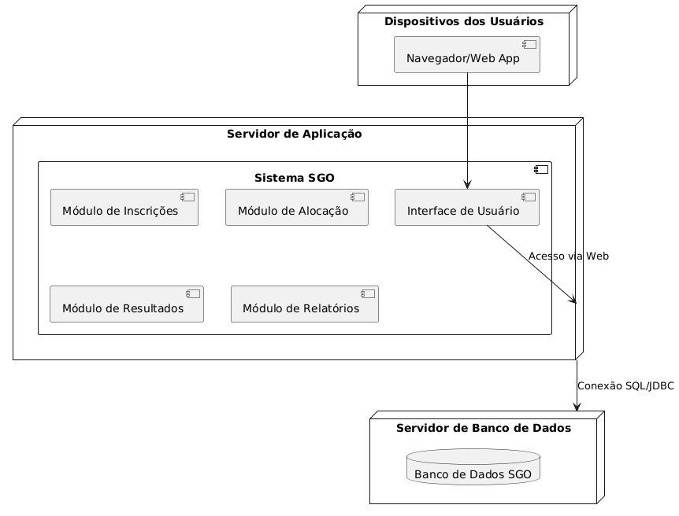
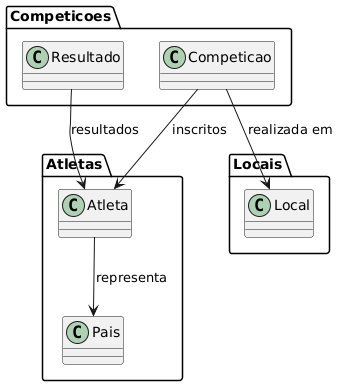

# Sistema de Gestão das Olimpíadas (SGO)

## Aluno
- Felipe Augusto Moreira Corrêa

## Descrição

O Sistema de Gestão das Olimpíadas (SGO) é uma solução proposta para coordenar e gerenciar os diversos aspectos do evento olímpico. O sistema abrange o cadastro de competições, inscrição de atletas, alocação de locais para provas, registro de resultados e geração de relatórios de medalhas.

## Funcionalidades Principais

- **Cadastro de Competições:** Permite registrar competições com informações como modalidade, data, horário, local e lista de atletas inscritos.
- **Inscrição de Atletas:** Facilita a inscrição de atletas em competições específicas, garantindo que cada atleta represente um único país por modalidade.
- **Alocação de Locais:** Assegura a alocação dos locais das competições, evitando conflitos de horário e garantindo a realização adequada dos eventos.
- **Registro de Resultados:** Permite o registro dos resultados de cada competição, definindo os atletas vencedores e os classificados.
- **Relatórios de Medalhas:** Gera relatórios que exibem o desempenho dos países com base na contagem de medalhas de ouro, prata e bronze.

## Diagramas UML

### Diagrama de Classes

### Diagrama de Componentes

### Diagrama de Implantação

### Diagrama de Pacotes

## Histórias de Usuário

### Estória de Usuário 1 – Cadastro de Competição
- **Como:** Organizador
- **Quero:** Cadastrar uma nova competição no sistema, informando modalidade, data, horário, local e lista de atletas.
- **Para:** Organizar e planejar o evento de forma eficiente.

---

### Estória de Usuário 2 – Inscrição de Atletas
- **Como:** Atleta
- **Quero:** Me inscrever em competições específicas.
- **Para:** Participar do evento representando meu país, garantindo que cada modalidade seja disputada por apenas um representante por país.

---

### Estória de Usuário 3 – Alocação de Locais
- **Como:** Organizador
- **Quero:** Alocar locais para as competições.
- **Para:** Evitar conflitos de horário e garantir que cada evento ocorra em um ambiente apropriado.
  
---

### Estória de Usuário 4 – Registro de Resultados e Geração de Relatórios de Medalhas
- **Como:** Organizador
- **Quero:** Registrar os resultados das competições (definindo primeiro, segundo e terceiro lugares) e gerar relatórios de medalhas.
- **Para:** Acompanhar o desempenho dos países e manter o controle da competição de forma transparente.
